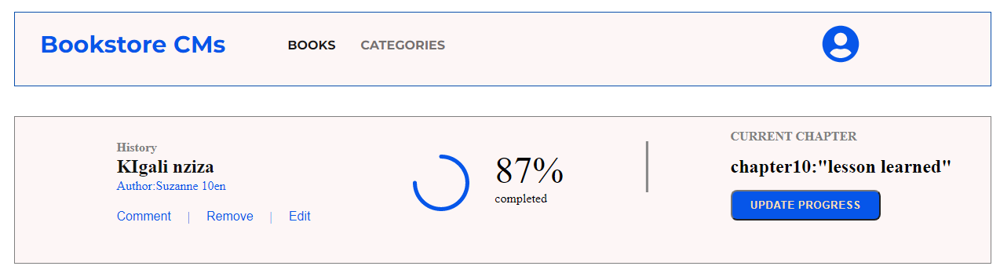

# Book store

This project will lay foundations for the Bookstore website.
React and Redux app was built and set up routing using React Router.
This app is able to add and delete books from the booklist by clicking on the delete button
the project built-in :

React
Redux
webpack
babelrc
linter

> 

## Live Demo

[link to bookstore](add-remove-bookstore.netlify.app)

To get a local copy up and running follow these simple example steps.

### Prerequisites
npm/yarn installed

### Setup-react
clone the repo: git clone git@github.com:https://github.com/Mucyosoda/Module-3-BOOKSTORE.git
jump to the active branch: git checkout initialize-bookstore

# Install
- in the terminal, run: npm installor npm i
# Usage
- now run npm start to start the app
# Run tests
- Author only
# Deployment
- This project was deployed on Netlify 

## Authors

👤 **Mucyo Claude**

- GitHub: [@githubhandle](https://github.com/githubhandle)
- Twitter: [@twitterhandle](https://twitter.com/twitterhandle)
- LinkedIn: [LinkedIn](https://linkedin.com/in/linkedinhandle)

## 🤝 Contributing

Contributions, issues, and feature requests are welcome!

Feel free to check the [issues page](../../issues/).

## Show your support

Give a ⭐️ if you like this project!

## Acknowledgments

- Hat tip to anyone whose code was used
- Inspiration
- etc

## 📝 License

This project is [MIT](./MIT.md) licensed.
